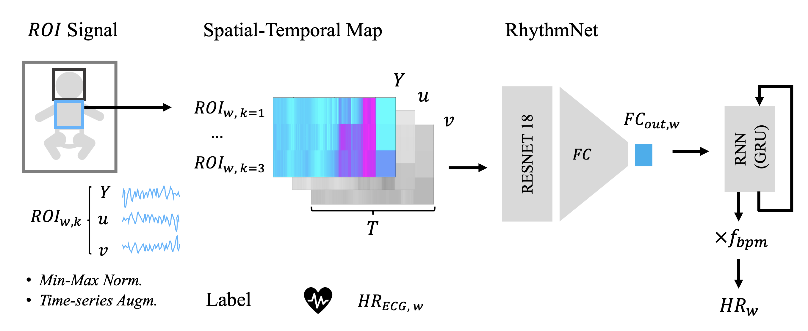

# A Deep Learning Approach for Non-Contact Heart Rate Monitoring
## neonatal_video_heart_rate

Deep learning pipeline for video-based heart rate prediction in neonates, leveraging signals from multiple body regions.



## Content

1. [RhythmNet Model](./src/model/rythmnet.py)
   

2. [Dataset](./src/dataset)

── 2.1 [stmaps dataloader](./src/dataset/data_loader.py)

── 2.2 [data augmentations](./src/dataset/signal_transforms.py)

── 2.3 [st_maps generation](./src/dataset/st_maps_from_signal_pkl.py)

3. [Model Training](./src/train_optuna.py)

## Usage
> - Install dependencies
> ```bash
> conda env create -f environment.yml
> ```


## Our Publication
[1] A. Grafton, A. Castelblanco et al., Advancing Neonatal Care: A Deep Learning Approach for Non-Contact Heart Rate Monitoring. 2024 IEEE International Conference on E-health Networking (HealthCom), Nara, Japan, 2024, pp. 1-6, doi: 10.1109/HealthCom60970.2024.10880770.

> <a href=https://doi.org/10.1109/HealthCom60970.2024.10880770>https://doi.org/10.1109/HealthCom60970.2024.10880770 </a>

## References
[2] X. Niu, S. Shan, H. Han, and X. Chen, RhythmNet: End-to-end heart rate estimation from face via spatial-temporal representation,'' IEEE Trans. Imag. Proces., vol. 29, pp. 2409-2423, 2020, doi: 10.1109/TIP.2019.2947204.

The RhythmNet model and loss function scripts are modified and adapted from the RhythmNet code repository: 
> <a href=https://github.com/AnweshCR7/RhythmNet>https://github.com/AnweshCR7/RhythmNet </a>